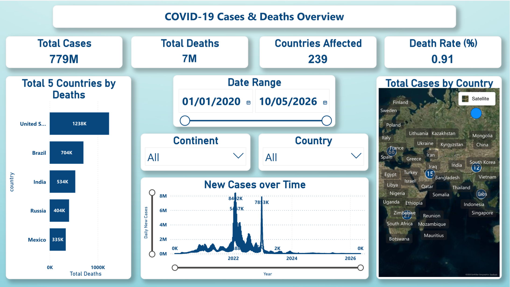
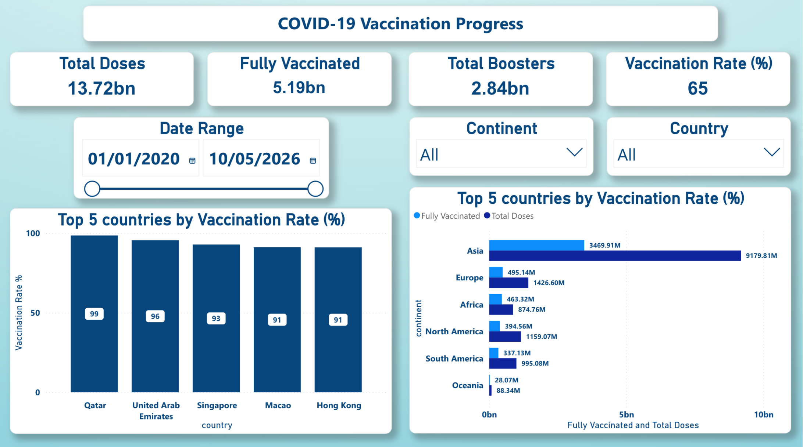
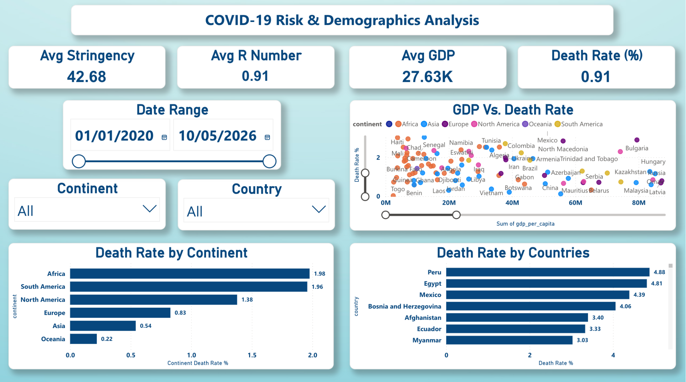
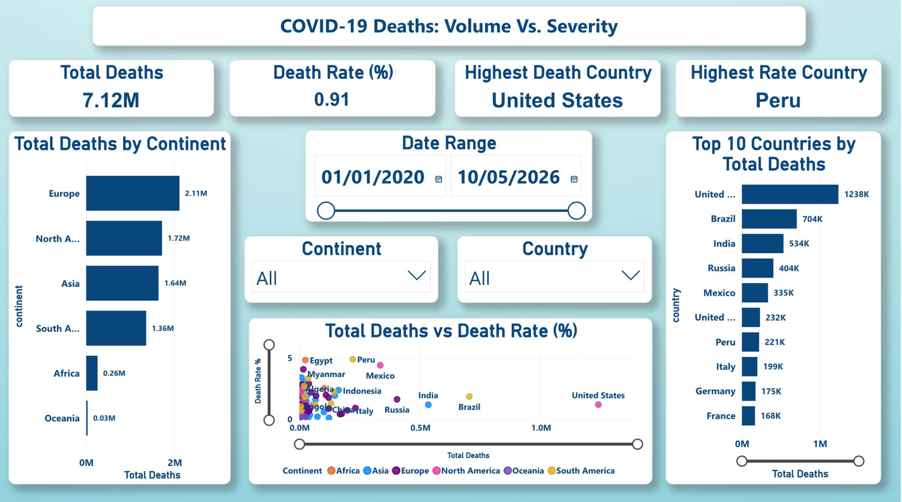

# COVID-19 Global Data Analysis

An end-to-end data analysis project exploring global COVID-19 patterns across 
262 countries using SQL and Power BI covering cases, deaths, vaccinations, 
government response and demographic risk factors.

---

## Dashboard Preview

### Cases & Deaths Overview

### Vaccination Progress

### Risk & Demographics Analysis

### Deaths: Volume vs Severity

---

## Business Problem

- Which countries and continents were hit hardest by COVID-19?
- Did government restrictions reduce death rates?
- Did wealth, age or hospital capacity predict survival?
- Is the country with the most deaths the same as the deadliest?

---

## Objectives

- Clean and analyse 589,779 rows of real global COVID data
- Explore cases, deaths, vaccinations and government response
- Identify demographic risk factors using SQL analysis
- Build an interactive 4-page Power BI dashboard

---

## Dashboard Breakdown

### 1. Cases & Deaths Overview
- Total cases, deaths, death rate, countries affected
- Top 5 countries by total deaths
- New cases over time (2020–2026)
- Interactive world map by country

### 2. Vaccination Progress
- Total doses, fully vaccinated, boosters, vaccination rate %
- Top 5 countries by vaccination rate
- Fully vaccinated vs total doses by continent
- Rollout trend over time

### 3. Risk & Demographics Analysis
- Avg stringency index, R number, GDP, death rate
- GDP vs Death Rate scatter plot by continent
- Death rate by continent and country

### 4. Deaths: Volume vs Severity
- Total deaths vs death rate % comparison
- Total deaths by continent
- Total deaths vs death rate scatter plot
- Top 10 countries by total deaths

---

## Key Insights

- Global death rate: **0.91%** across 779M confirmed cases
- **United States** recorded the most deaths (1.24M) but **Peru** had 
  the highest death rate (4.88%)
- Why? The US ran mass testing, millions of mild cases kept the rate low. 
  Peru only tested the critically ill - making the rate artificially high.
  Same virus. Very different numbers. Context changes everything.
- **Europe** was hit hardest by total deaths (2.11M)
- **13.72 billion** vaccine doses administered globally — 65% vaccination rate
- **Asia** administered the most doses (9.18bn), led by China
- Countries with higher testing rates consistently had lower death rates
- Timing of lockdowns mattered more than their strictness

---

## Tools & Technologies Used

- **SQL (SQLite / DB Browser)**: data cleaning, EDA, survival analysis
- **Power BI**: DAX measures, 4-page interactive dashboard
- **Python**: data preprocessing and CSV formatting

---

## SQL Concepts Used

Data cleaning, CTEs, Window Functions, ROW_NUMBER(), DENSE_RANK(),
SUM() OVER(), Temp Tables, JOINs, Subqueries, CAST, CASE WHEN,
PARTITION BY, data quality checks

---

## Power BI / DAX Concepts Used

SUMX, FILTER, VALUES, CALCULATE, MAX, DIVIDE,
AVERAGEX, DISTINCTCOUNT, TOPN, SELECTEDVALUE,
Scatter Charts, Map Visuals, Slicers, KPI Cards

---

## Dataset

- **Source:** Our World in Data
- **Link:** https://ourworldindata.org/covid-deaths
- **Rows:** 589,779 | **Countries:** 262 | **Columns:** 20
- Not included in repo due to file size, download from link above

---

## Project Files

- `COVID19_Analysis.pdf` — 4-page Power BI dashboard
- `COVID_Project_Brief.docx` — project brief and analysis plan
- `COVID_Analysis_Report.docx` — full findings report with charts

---

## Author

Mannan Hakim
MBA | Data Analytics

LinkedIn: https://www.linkedin.com/in/mannan-hakim-aa654a250/
